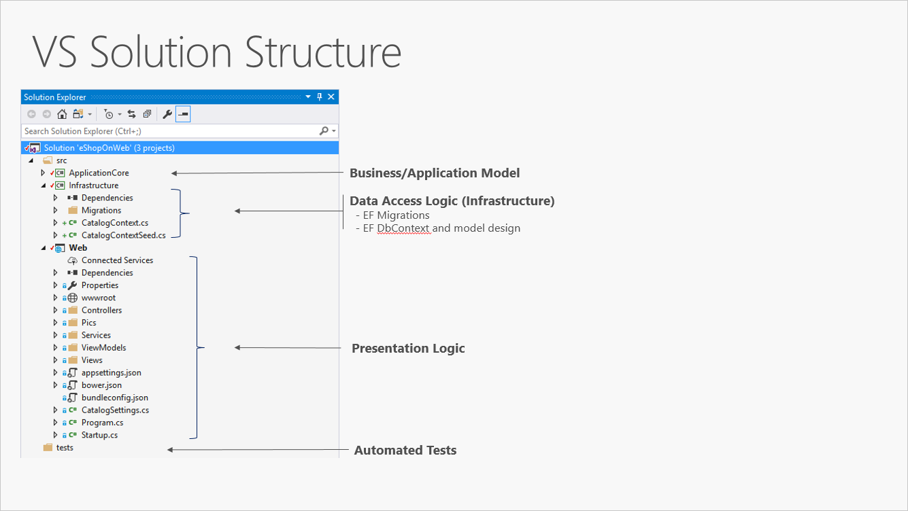
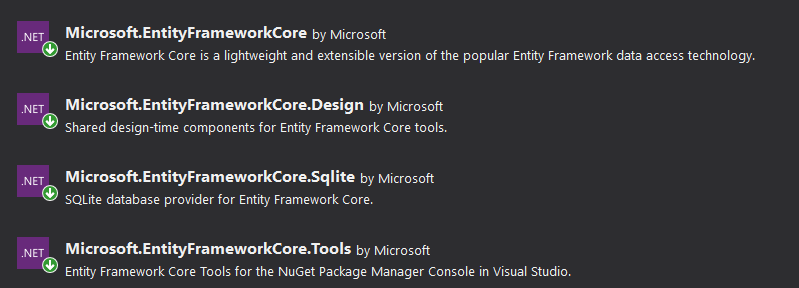

# Sobre

Esse é um exemplo simples e prático de como utilizar o **Entity Framework Core** em um projeto de `Arquitetura de Camadas`

### Backend

- .Net Core 3.1
- ASP .NET Core 3.1
- Entity Framework Core 3.1
- C#

### Banco de Dados

- SQLite

## Overview

Conforme os passos da documentação [Microsoft](https://docs.microsoft.com/pt-br/dotnet/architecture/modern-web-apps-azure/common-web-application-architectures#traditional-n-layer-architecture-applications) seguirei a estrutura da imagem abaixo:



---

## Criando as Camadas

As Camadas seguem o tipo de projeto abaixo:

- **Domain:** _ClassLib_
- **Infrastructure:** _ClassLib_
- **Presentation:** _WebApi_

---

### Pacotes Nuget

Adiciono os pacotes abaixo mas camadas _Infrastructure_ e _Presentation_



### Domain

Crio a pasta **Models** e a **classe** `Cliente` como o código abaixo:

```c#
    public class Cliente
    {
        public Cliente()
        {
            Id = new Guid();
        }

        public Guid Id { get; set; }
        public string Nome { get; set; }
        public string Email { get; set; }
        public DateTime DataCadastro { get; set; }
    }
```

### Infrastructure

Crio a pasta **Context** e a **classe** `MeuDbContext` como o código abaixo:

```c#
    public class MeuDbContext: DbContext
    {
        public MeuDbContext(DbContextOptions options): base(options)
        {

        }
        public DbSet<Cliente> Clientes { get; set; }
    }
```

Crio também a pasta **DataBase** e dentro dessa pasta crio um arquivo **_database.db_**


### Presentation

Modifico o arquivo ___appsettings.Development.json___ e insiro o código:

```json
"ConnectionStrings": {
    "DefaultConnection": "Data Source=../Infrastructure/DataBase/database.db"
  }
```

* Criando Controller __ClienteController__

```c#
    [Route("api/[controller]")]
    [ApiController]
    public class ClienteController : ControllerBase
    {
        private readonly MeuDbContext context;
        public ClienteController(MeuDbContext context)
        {
            this.context = context;
        }
        [HttpGet("cadastrar")]
        public IActionResult Index()
        {
            var cliente = new Cliente()
            {
                Nome = "Paulo Barbosa",
                Email = "paulohjbarbosa@gmail.com",
                DataCadastro = DateTime.UtcNow
            };

            /* TROCAR E COLOCAR NO REPOSITORY */
            context.Clientes.Add(cliente);
            context.SaveChanges();

            return Ok();
        }
    }
```
---

## Migrations

Agora basta executar as __Migrations__ seguindo a documentação [Visão geral das migrações](https://docs.microsoft.com/pt-br/ef/core/managing-schemas/migrations/?tabs=dotnet-core-cli).